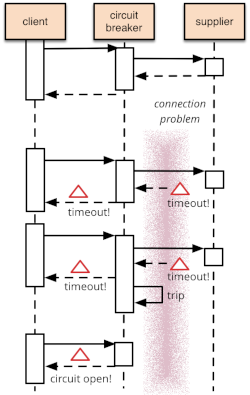

# Spring Boot Resilience4j

### Patrón Circuit Breaker

Relacionado con programación reactiva.
Para un análisis detallado del patrón Circuit Breaker, véase el análisis de [Martin Fowler](https://martinfowler.com/bliki/CircuitBreaker.html)

+ Idea central del patrón:
    - Envolver la función en un objeto Circuit Breaker que monitorizará los fallos.
    - Cuando los fallos alcancen cierto umbral, el Circuit Breaker se dispara:
        - Todas las llamadas siguentes volverán con error, sin que se realice la llamada 'protegida'
        - Se guardarán alertas de los fallos
        - El Circuit Breaker detecta si la llamada protegida está nuevamente operativa y efectúa llamadas de nuevo
    - En llamadas asíncronas, colocaremos las requests en una queue, que el proveedor consumirá a su propia velocidad
    (evitamos sobrecarga de servers)  
    - Cualquier cambio en estado del Circuit Breaker deberemos monitorizarlo.      
        




#### Transición de estados


### Utilización de Resilience4j

<b>Ejemplo oficial de uso de librería Resilience4j</b>.
Revisar documentación en https://resilience4j.readme.io/docs/getting-started-3

##### Funcionamiento

Folder tests para comprobación de ejemplos.
Puede ejecutarse el servicio disponible en http://localhost:9080

+ The BackendAService shows how to use the Resilience4j Annotations.
+ The BackendBController shows how to use the functional style and the Spring Reactor operators.

#### Funcionamiento con Grafana / Prometheus

Además, posible monitorización con Grafana y Prometheus servers. Para configurarlo:

###### En root folder:
```
docker-compose -f docker-compose.yml up
```

###### Verificar Prometheus
    - http://localhost:9090
    - Status >Targets > ambos endpoints deben estar "UP"

###### Configurar Grafana:
    
    - http://localhost:3000
    - Integración con Prometheus
        - Access configuration
        - Add data source
        - Select Prometheus
        - Use http://localhost:9090 y acceder con value "Browser" 
    - Configurar dashboard
        - Access home
        - Importar dashboard
        - Subir dashboard.json desde /docker
    
#### Highlights

+ application.yml configs:
    - resilience4j.circuitbreaker
    - resilience4j.retry
    - resilience4j.bulkhead (mampara)
    - resilience4j.thread-pool-bulkhead
    - resilience4j.ratelimiter (limitador velocidad)
    - resilience4j.timelimiter
    
+ BackendAService. Resilience4j annotations.
+ CircuitBreakerTest. 
+ RetryTest

##### Comparativa Hystrix / Resilience4j

+ En Hystrix, las llamadas a sistemas externos deben estar envueltas en un HystrixCommand. Resilience4j proporciona 
decorators para mejorar cualquier interfaz funcional, lambda o method reference con un Circuit Breaker, Rate Limiter
 (limitador velocidad), o Bulkhead.
+ Proporciona decoradores para reintentar llamadas fallidas o almacenar en caché los resultados de las llamadas. 
+ Puede apilar más de un decorador en cualquier interfaz funcional, expresión lambda o method reference. Esto significa 
que puede combinar un decorador Bulkhead, RateLimiter y Retry con un decorador CircuitBreaker. La mejora es que  
seleccionamos el decorador que necesitamos y no necesitamos nada más. Cualquier función decorada se puede ejecutar de forma síncrona o 
asíncrona utilizando CompletableFuture o RxJava.
+ El CircuitBreaker puede abrirse cuando demasiadas llamadas superan un determinado umbral de tiempo de respuesta, 
incluso antes de que el sistema remoto no responda y se produzcan excepciones.
+ Hystrix solo realiza una única ejecución cuando está en estado half-open para determinar si cerrar un CircuitBreaker.
Resilience4j permite realizar un número configurable de ejecuciones y compara el resultado con un umbral configurable 
para determinar si cerrar un CircuitBreaker.
+ Tanto Hystrix como Resilience4j emiten un flujo de eventos que son útiles para que los operadores del sistema 
monitoricen las métricas sobre los resultados de ejecución y la latencia.

 

