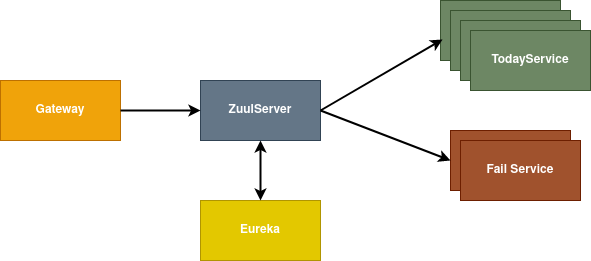

## Ejercicio: Spring Boot Today

Estado y comportamiento:
+ Actualmente se puede probar el balanceo de carga desarrollado sin Docker
+ Para la ejecución completa con Docker, es necesario parametrizar las url del registry de cada microservicio 
(application.yml o bien .properties) - CON ZUUL LLEGA BIEN, NO CON GATEWAY. VER README GENERAL.
+ Revisar [Rutas en Gateway](gateway/src/main/resources/application.yml)


<b>Diagrama:</b>



#### Notas Útiles

+ Ejecución completa del entorno: <b>docker-compose up</b> (levanta todos los containers)

+ Build del proyecto (compilación del microservicio + construcción imagen)

```
./gradlew :spring-boot-today:today-service:build

docker build --tag=spring-boot-training-today .

docker-compose up [nombreContainer]
```

+ Portainer:
    - http:<nolink>//localhost:9500. User admin / K99ARjL5vFvpW7Ba

+ URL' disponibles

    - A través de Gateway:
        - http://[IP_DOCKER]:9999/spring-today-service/v1/today
        - http://[IP_DOCKER]:9999/spring-today-service/v1/todayJson    
    - A través de Zuul: 
        - http://[IP_DOCKER]:8762/spring-today-service/v1/today
        - http://[IP_DOCKER]:8762/spring-today-service/v1/todayJson
    - Directo al microservicio
        - http://[IP_DOCKER]:7777/v1/today
        - http://[IP_DOCKER]:7777/v1/todayJson
    - Fail (directo)
        - http://localhost:8888/v1/fail   
    
    
#### Highlights

+ Fijado timeout de la Gateway en config. Si fijamos redirección a /todayJsonDelayed de today-service, saltará timeout de Gateway antes.
+ Soluciones implementadas en Gateway
    - Ruta path_today_simple (evita respuesta NO Json redireccionando a URL de otro microservicio)
    - Ruta path_json_parameterized (fijamos response a forbidden)
    - Ruta retry_test (intentos de reconectar al recibir un 502 llamando a back, hasta finalmente mostrar el estado)
    - Hystrix no soporta redirect. Todos los forward habrán de ser en el mismo host.
    

##### TO-DO 

+ Adecuación rutas en Gateway para que lleguen a Zuul correctas para balanceo (falta introducir nombre app)
+ Parametrización IP's Docker 
+ Inclusión cláusula 'DependsOn' en docker-compose.yml para arranque completo 